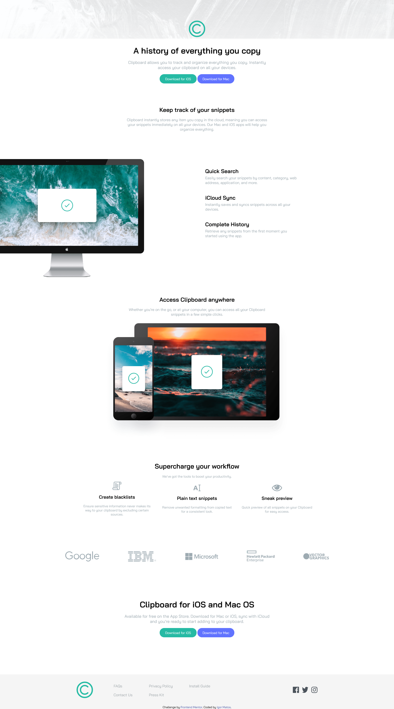
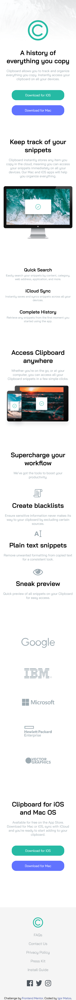

# Frontend Mentor - Clipboard landing page solution

This is a solution to the [Clipboard landing page challenge on Frontend Mentor](https://www.frontendmentor.io/challenges/clipboard-landing-page-5cc9bccd6c4c91111378ecb9). Frontend Mentor challenges help you improve your coding skills by building realistic projects. 

## Table of contents

- [Overview](#overview)
  - [The challenge](#the-challenge)
  - [Screenshot](#screenshot)
  - [Links](#links)
- [My process](#my-process)
  - [Built with](#built-with)
  - [What I learned](#what-i-learned)
  - [Continued development](#continued-development)
  - [Useful resources](#useful-resources)
- [Author](#author)
- [Acknowledgments](#acknowledgments)

## Overview

### The challenge

Users should be able to:

- View the optimal layout for the site depending on their device's screen size
- See hover states for all interactive elements on the page

### Screenshot

### Links

- Solution URL: [https://github.com/IgorWMatos/frontend_mentor05](https://github.com/IgorWMatos/frontend_mentor05)
- Live Site URL: [https://igorwmatos.github.io/frontend_mentor05/](https://igorwmatos.github.io/frontend_mentor05/)

## My process

The first step of this project was to mentally build the HTML structure with its semantics, and how everything that was offered in this challenge would fit. Only then, I tagged and inserted images as to follow the images with the challenges design.

Once everything was set, I utilized SCSS to stylize and shape the designs.

### Built with

- Semantic HTML5 markup
- CSS custom properties
- Flexbox

### What I learned

the most challenging process in this project was to put the image out of the frame. As the project was larger than the previous one, I've noticed the importance of managing time and a personal deadline.

## Author

- Website - [Igor Matos](https://github.com/IgorWMatos)
- Frontend Mentor - [@IgorWMatos](https://www.frontendmentor.io/profile/IgorWMatos)